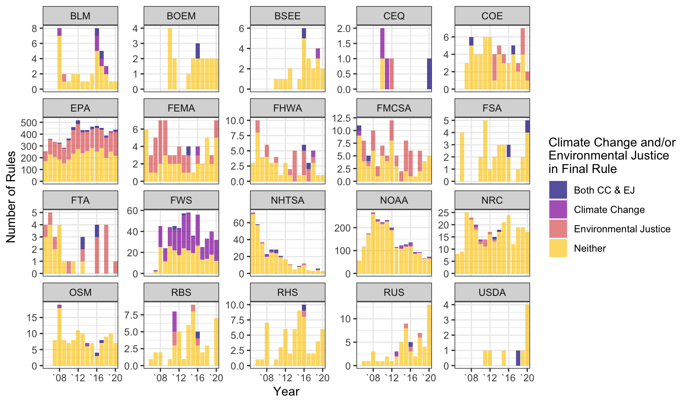
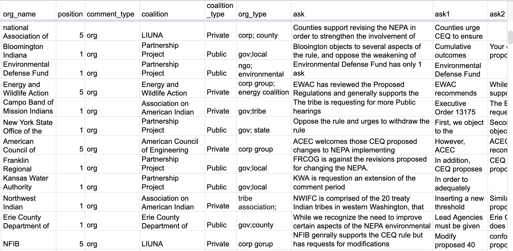
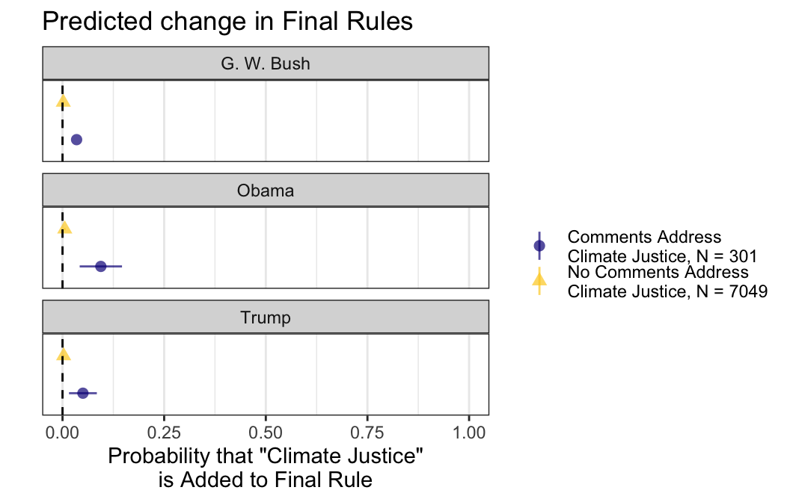

```{r setup, include = FALSE}
# chunks options:
# hide code and messages by default (warning, message)
# cache everything 
knitr::opts_chunk$set(warning = FALSE, 
                      message = FALSE,
                      echo = FALSE, 
                      #fig.path = "figs/",
                      cache = FALSE, 
                      fig.align = 'center',
                      fig.retina = 2,
                      dpi = 100)
# Xaringan: https://slides.yihui.name/xaringan/
library("xaringan")
library("xaringanthemer")
library("here")
library("tidyverse")
library(magrittr)


style_mono_light(base_color = "#3b444b",
          link_color = "#297acc", #"#B7E4CF",
          background_color = "#FAF0E6", # linen
          header_font_google = google_font("Open Sans"), 
          text_font_google = google_font("Roboto"), 
          text_font_size = "30px",
          #padding = "20px",
          code_font_google = google_font("Inconsolata"), 
          code_inline_background_color    = "#F5F5F5", 
          table_row_even_background_color = "#ddede5",
          extra_css = 
            list(".remark-slide-number" = list("display" = "none")))

#xaringan::decktape(file =  here("docs/present/oversight-pres.html"), output = here("docs/present/oversight-pres.pdf"))

```

class: inverse center

# The Broader Project: Public Pressure


Mobilization


(grassroots, astroturf, elected officials)

↓

Getting policymakers' attention and framing policy debates

↓

Substantive policy influence

↓

Surviving judicial review

???
Hi, my name is Devin Judge-Lord; I'm a postdoc at Harvard Univ.
But today I am zooming in from down the coast on the homeland of the Lenape poeple.
I am so grateful to be able to share this with you.
- My work is at the intersection of two literatures that have not had much contact...On the one hand, social movements and civic engagement have long been a core interest of political scientists. We are highly uncertain about the size of effects from actions like letter writing, signing petitions, and protests, but there is little doubt that these things matter at a large enough scale.
- On the other hand, bureaucratic policy processes like agency rulemaking are often discussed as if they operate with a technocratic rationality. In a sense, mass politics is missing from a lot of the administrative law literature and even from political science theories and formal models of bureaucratic policymaking. 
- The paper I am presenting today is a small part of a larger book project: 
---

class: inverse center

# The Broader Project: Public Pressure


Mobilization


(grassroots, astroturf, elected officials)

↓

<mark>Getting policymakers' attention and framing policy debates</mark>

↓

Substantive policy influence

↓

Surviving judicial review


???

It is a middle step in the causal chain from mobilization to substantive policy influence. 

I need enough about mobilization to be clear about who is empowered.

I need enough on substantive policy influence to be honest about the limited power of framing and discourse effects in any one policy fight. 
But, this paper is really about the aggregate effects of many linked campaigns on the discourse and issue frames in the policy process---that is, how a movement affects policymaking 
across institutions and over time.

---

# Motivation 

- Climate change affects nearly everything, but policy is inconsistently framed as "climate policy"

--

- Nearly all policies have disparate effects, but climate policy is inconsistently framed as a distributive justice ("climate justice") issue


--

- With or without landmark legislation, most U.S. climate policy will continue to be made in federal agencies

--

- A lack of public pressure is a key cause of legislative failure (Skocpol 2013)

---

# Questions

- Whom does agency rulemaking empower? 

  - Who raises climate change and climate justice issues?
  
  - Who tends to win?

- How receptive are different institutions to public pressure on climate and climate justice issues? 

  - How much does presidential support or hostility affect agency policymaking? 

  - Are bureaucracies with more experience more receptive? 

---


### If groups build the power to pass a Green New Deal, what happens when 30+ agencies write the actual policies? 

--

### Will organized public pressure carry over to agency policymaking? 
--
If so, by what mechanisms?

- General levels of public attention to policymaking?

- Specific pressure to adopt a climate justice frame?

- Which parts of government are most likely to be moved? 

---


## Preview of Findings 

- From 2005 to 2020, less than 8% of relevant agency rules addressed climate change, and only 2% addressed climate justice, despite growing activist demand

--

- 20% of all public comments mentioned climate change

--

- 20% of rules and 8% of comments mentioning climate change also mention environmental justice or climate justice

--

- Policies are more likely to change when there is more public pressure 
--
(1000 supporters = ~ 65 percentage point increase in the probability that claims will be addressed)

???

6 Big Green groups, along with CREDO Action and Democracy For America (Howard Dean's campaign organization), ran all campaigns raising CJ issues and mobilized nearly all CJ comments. 

CREDO	2	2	221557
Sierra Club	10	29	149621
Earthjustice	8	9	144559
NRDC	5	5	99813
PEW	3	3	63771
Defenders Of Wildlife	3	3	14700
Democracy For America	1	1	4426
Center For Biological Diversity	30	33	150

---

## Preview of Findings 

Public pressure affects policy debates.

???
Today, I'm going to show that public pressure can affect the policy process, but with a lot of caveats. And the caveats are often the most interesting part. 
The first caveat is that baseline rates of addressing EJ are very low from the Clinton through the Trump administrations. 

There is a lot of potential for change, which is a tough road for the movement, but helpful for the scientist trying to measure change.
--

- Policymakers rarely addresses Climate & EJ concerns (across administrations)
--
, but they are much more likely to address Climate & EJ when pressured
--
, especially **receptive policymakers** who have **not already taken a position**.

???
- With larger EJ coalitions and more public attention, agencies are more likely  📈 to **add** EJ language **where there was none**
- BUT agencies also anticipate public attention, making **existing** EJ analyses less likely 📉 to **change** on higher-salience rules.

???
The second caveat is that pressure matters to receptive policymakers--policymakers who are used to thinking about ej at institutions with organizational processes for addressing EJ. 

Third is that the scale of public attention makes policymakers more likely to address EJ when they did not, but higher-salience policies that already addressed EJ are less likely to change. I suspect this is because agency officials have already dotted their i's and crossed their t's in these cases, and there is little room left for policy to move. 

--

HOWEVER, groups raising climate change are usually "big green" (White) advocacy organizations.  
--

- Big greens are much more likely to have their substantive policy demands met than tribes or frontline EJ groups.

???

Finally, assessing the normative implications requires us to understand who is advocating for whom. In the case of comments on federal agency rules, it is "big green" national advocacy groups that have historically led a very White environmental movement. 
These "big greens" are more likely to get substantive policy demands met than Tribes and frontline community groups. So, a lot hinges on the extent to which these national organizations represent EJ communities.

---


# Theory

Pressure campaigns bolster **technical information** (e.g., science, legal arguments) with **political information** (e.g., the number of organizations in a coalition, petition signatures, the level of public attention).

Institutions are more **receptive** to technical and political claims when they align with policy agendas and instututional cultures. 


---

## Example: EPA responds to comments 

2013 Obama EPA proposed rule: *Air Quality State Implementation Plans; Approvals and Promulgations: Navajo Nation; Regional Haze Requirements for Navajo Generating Station* 

- No mention of climate change, one paragraph on environmental justice.

In response to 421 comments raising climate justice concerns, the final rule added nine paragraphs on environmental justice and a brief mention of climate change: 

> "EPA agrees that climate change is an important issue...Although regulation of greenhouse gases is conducted under separate statutory requirements from regional haze"


<!--, EPA is mindful that this BART determination for NGS is not the only regulatory program that affects this facility and the region."-->

---

## Example: EPA ignores comments

2017 Trump EPA proposed rule: *State of Texas, Regional Haze and Interstate Visibility Transport Federal Implementation Plan* makes no mention of climate change. 
<!--
 "Texas' participation in the Cross-State Air Pollution Rule’s (CSAPR) trading program for ozone-season NOX qualifies as an alternative to BART. We are approving Texas’ determination that its EGUs are not subject to BART for particulate matter (PM)."
-->
A short EJ section mentions only SO2, not NOX or PM.

61 Comments, including EarthJustice et al.: 

> "Climate change may also have an effect on the outdoor air pollutant concentrations, especially ozone."

The final rule makes no mention of climate change and no change to the EJ section.


???

[EartheJustice et al.] (https://www.regulations.gov/comment/EPA-R06-OAR-2016-0611-0083)

The EPA believes that this action does not have disproportionately high and adverse human health or environmental effects on minority populations, low-income populations, and/or indigenous peoples, as specified in Executive Order 12898 (59 FR 7629, February 16, 1994). We have determined that this rule will not have disproportionately high and adverse human health or environmental effects on minority or low-income populations because it increases the level of environmental protection for all affected populations without having any disproportionately high and adverse human health or environmental effects on any population, including any minority or low-income population. The rule limits emissions of SO

Bernard, S., Samet, JM, Grambsch, A, Ebi, KL, and Romieu, I, The Potential Impacts of Climate Variability and Change on Air Pollution-Related Health Effects in the United States. Environmental Health Perspectives 2001. 109(Supplement 2): p. 199-209.


---


## Data: 40,139 policy documents (13,111 proposed and final rule pairs) from 46 agencies

```{r cj-data-agencies100, out.width = "90%"}

knitr::include_graphics("figs/cj-data-agencies100-2.png")
```

---

```{r cj-data-agencies, out.width = "90%"}


```

---

## Data: 39,392,957 public comments

- 20% <!--, 17,857,018 (421,880 unique)--> raise "climate change"

- 2% <!--, 3,248,697 (2,138 unique)--> also mention environmental justice or cimate justice

- 82% of all comments raising EJ also mention climate change, but only 14% of **unique** comments raising EJ also mention climate change


---

## Methods: Unique and duplicate comments


```{r percent-match, fig.show = "hold", out.width = "60%", fig.cap="Example: Identifying Coalitions by the Percent of Matching Text in a Sample of Public Comments"}

knitr::include_graphics("figs/comment_percent_match_plot.png")
```

---

## Methods: Hand-coded coalitions and policy change

```{r datasheet, fig.show = "hold", out.width = "100%", fig.cap="Example: Identifying Coalitions by Hand"}


```

---

## Draft rules that did and did not address climate

```{r climate-comments, out.width = "85%"}

knitr::include_graphics("figs/climate-comments-1.png")
```

---

## Draft rules that did and did not address EJ/CJ

```{r cj-comments, out.width = "85%"}
knitr::include_graphics("figs/cj-comments-1.png")
```


---

class: inverse middle center

# Results 

---

```{r table,  out.width = "80%"}


```

---

## Results: Adding Climate Change to Policy

```{r climate-m-PR-president-median-1, out.width = "60%"}
knitr::include_graphics("figs/climate-m-PR-president-median-1.png")
```

- 🔬 Scientific Information ✅  

---

## Results: Adding Climate Justice to Policy

```{r cj-m-PR-president-median-1, out.width = "60%"}

```

- ✊🏿 Distributive Information ✅  

---

## Results: Adding Climate Change to Policy 

```{r climate-m-PR-climatecomments-agencyFE,  out.width = "80%"}


knitr::include_graphics("figs/climate-m-PR-climatecomments-agencyFE-1.png")

```

- 🔬🔁 Coalition Size ✅  


---

## Results: Adding Climate Justice to Policy 

```{r cj-m-PR-cjcomments-agencyFE,  out.width = "80%"}


```

- ✊🏿🔁 Coalition Size ✅  


## To sum up, yes, movements matter (even when victories are rare)

|                                            | Add Language
| ------------------------------------------ | :--: | :--: |
| 🔬 Scientific Information (Climate Concerns)  | 📈 |
| ✊🏿 Distributive Information (EJ/CJ Concerns)     | 📈 | 
| 🔬/✊🏿🔁 Coalition Size           | 📈 | 
| 🏛️ Policy Receptivity                             | 📈 |
| 📢 General Level of Public Attention               | 📈 | 


<!--| 📢x✊🏿 Specific (Conditional) Pressure            | 📉 | ❓ | -->

With larger coalitions and more public attention, agencies are more likely  📈 to **add** EJ language **where there was none**<!--, BUT agencies also anticipate public attention, making **existing** EJ analyses less likely 📉 to **change** on higher-salience rules.-->

---

class: inverse

### Thank you!

- Paper, slides, data: [judgelord.github.io/research/ej](judgelord.github.io/research/cj)

- Rules related to Climate and EJ currently open for comment: [judgelord.github.io/rulemaking/open]( https://judgelord.github.io/rulemaking/open)

--

### Next Steps

- More on coalition structure and policy success, especially opposing coalitions
- Better (hand-coded) measures of policy change
- Model changes in texts that already discuss climate/EJ/CJ
- Additional terms (e.g., "warming") and analysis of change in term frequency
- Better estimation


---

class: inverse center middle 

# Extra Slides 

---

## Results: Adding Climate Change to Policy

```{r climate-m-PR-comments-agencyFE, out.width = "80%", fig.show = "hold"}

knitr::include_graphics("figs/climate-m-PR-comments-agencyFE-1.png")

```

- 🔬 Scientific Information ✅  
- 📢 General Public Pressure/Attention ✅  
<!-- 📢 x 🔬 Conditional Public Pressure/Attention ⏪  -->

---


## Results: Adding Climate Justice issues to Policy

```{r cj-m-PR-comments-agencyFE, out.width = "80%", fig.show = "hold"}

knitr::include_graphics("figs/cj-m-PR-comments-agencyFE-1.png")

```

- ✊🏿 Distributive Information ✅  
- 📢 General Public Pressure/Attention ✅  
<!-- 📢 x ✊🏿 Conditional Public Pressure/Attention ⏪  -->

